# Data-and-Business-Analytics-Case-Study-Hotel-booking

## Introduction
Chosen a dataset of Hotel Booking Demand from Kaggle. This data set contains booking information for a city hotel and a resort hotel under the same company based in Portugal, and includes information such as when the booking was made, length of stay, the number of adults, children, and/or babies, and the number of available parking spaces, among other things. 

The dataset contains 32 attributes/columns and 119,390 tuples/rows.

## Description
-> Performed in-depth Exploratory Data Analysis and visualization and gained important insights (EDA) 
-> Predicted whether a particular booking made would be cancelled or follow through with 99.9% accuracy (CancellationPred) 
-> Forecasted number of bookings in the near future using time series analysis (TimeSeriesAnalysis)

### EDA
#### Percentage of bookings that got cancelled
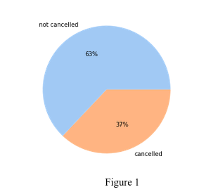
#### Demographic of customers
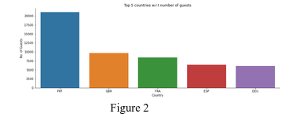
#### Average daily rate vs Reserved room type for both hotels
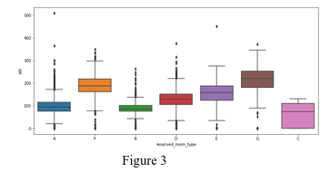
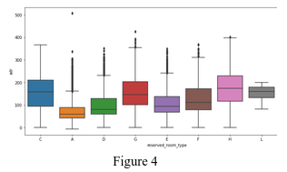
#### Average prices of hotel rooms over the year
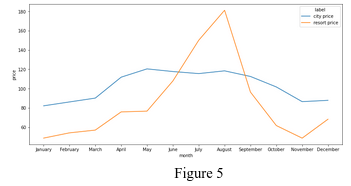
#### Footfall throughout the year
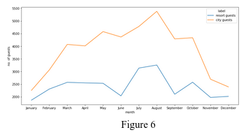
#### Average duration of stay in both the hotels
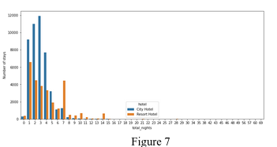
#### Insights
Prices in the Resort Hotel are much higher during the summer, most probably because of more people taking vacations during summer, and prices of city hotels are more or less consistent and are most expensive during Spring and Autumn.  
The city hotel has the higher footfall of the two. The City hotel has more guests during spring and autumn, when the prices are also highest which is consistent with the economic principle that as demands rise so do the prices. In fact we can see similar peaks and dips in demand as we saw in the prices of these hotels. Both hotels have the fewest guests during winter.  
For the city hotel the pattern of duration of stay is relatively consistent, it almost resembles a normal distribution with a peak at a duration of stay of 3 days and decreasing on either side. The resort hotel shows that the most common duration of stay is one day and it keeps decreasing till 6 days and then shoots up for duration of stay for 7 days which is actually the second most common duration of stay after a single day.

### Cancellation Prediction
#### Pipeline
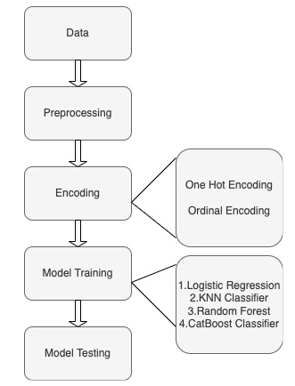
#### Results
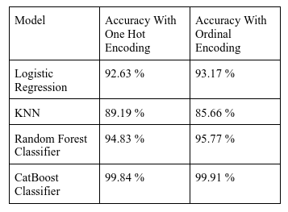
 We found that the CatBoost classifier has best fit the dataset. Since we are getting 99.91 % accuracy in the testing set, we conclude that the model has not overfitted the dataset. Because of the high accuracy of these predictions, these models can be used for real businesses.

### Time Series Analysis
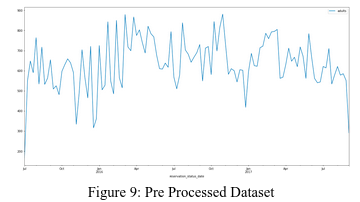
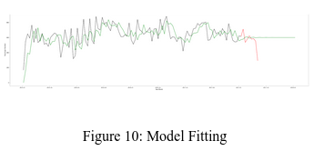
 The model has fit the time series, but the predictions were not very accurate. The reason behind this is the small dataset of only two years. Larger datasets are needed to train a better time-series model.
